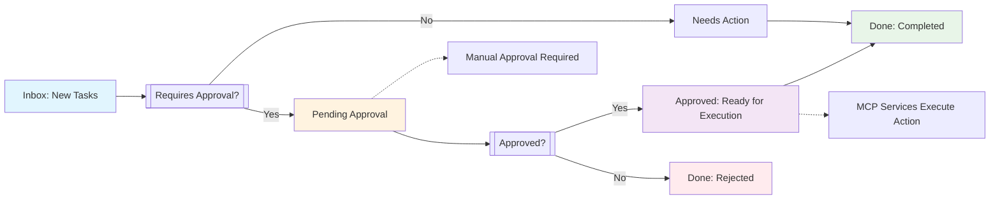

# Digital FTE Dashboard

> Last Updated: 2026-02-01 15:31:14

---

## System Status

| Component | Status | Notes |
|-----------|--------|-------|
| Vault | Active | AI_Employee_Vault |
| File Watcher | Stopped | Check with `./scripts/run_watchers.sh` |
| Backend API | Stopped | Start with `./scripts/run_backend.sh` |
| Gmail MCP | Not Configured | OAuth token required |
| WhatsApp MCP | Not Configured | QR scan required |
| LinkedIn MCP | Not Configured | Token configured |

**Mode:** `DRY_RUN=false` (Live mode - real actions)

---

## Today's Tasks

### Inbox (New)
<!-- Tasks in Inbox/ folder appear here -->
_Found 2 new tasks_

- [[Inbox/Prepare-Report.md|Prepare Report]]
- [[Inbox/test-task-from-cli.md|test task from cli]]

[[View All Inbox Tasks]](#view-inbox)

### Needs Action (In Progress)
<!-- Tasks in Needs_Action/ folder appear here -->
_No tasks in progress_

[[View All Needs Action Tasks]](#view-needs-action)

---

## Pending Approval

<!-- Tasks in Pending_Approval/ folder appear here -->
_Found 1 items awaiting approval_

| Item | Type | Created | Status | Action |
|------|------|---------|--------|--------|
| [[Pending_Approval/instagram-digital-fte-2026-02-01.md|instagram digital fte 2026 02 01]] | Unknown | 2026-02-01 12:00:00+00:00 | Awaiting Review | [[Approve Task]](#approve-task) / [[Reject Task]](#reject-task) |

[[Manage All Pending Tasks]](#manage-pending-tasks)

**To approve:** Move task file from `Pending_Approval/` to `Approved/`
**To reject:** Move task file from `Pending_Approval/` to `Done/` with rejection reason

---

## Recently Completed

<!-- Tasks in Done/ folder appear here -->
_Found 5 recently completed tasks_

- [[Done/facebook-ai-healthcare-2026-01-31.md|[2026-01-31 12:00:00+00:00] facebook ai healthcare 2026 01 31]]
- [[Done/instagram-ai-healthcare-2026-01-31.md|[2026-01-31 11:00:00+00:00] instagram ai healthcare 2026 01 31]]
- [[Done/facebook-ai-healthcare-2026-01-30.md|[2026-01-30] facebook ai healthcare 2026 01 30]]
- [[Done/email-meeting-notification-2026-01-30.md|[2026-01-30] email meeting notification 2026 01 30]]
- [[Done/whatsapp-test-2026-01-30.md|[2026-01-30] whatsapp test 2026 01 30]]

[[View All Completed Tasks]](#view-completed)

---

## Quick Actions

- **Add new task:** Create `.md` file in `Inbox/`
- **View logs:** Check `Logs/` folder
- **View plans:** Check `Plans/` folder
- **Approve action:** Move file from `Pending_Approval/` to `Approved/`
- **[[Start All Watchers]](./scripts/run_watchers.sh)** - Automatically process tasks through workflow
- **[[View Complete Task Workflow]](#task-workflow-diagram)** - Visual representation of task progression

---

## Metrics

| Metric | Value |
|--------|-------|
| Tasks Completed Today | 0 |
| Tasks Pending | 0 |
| Actions Awaiting Approval | 1 |
| Emails Sent | 0 |
| WhatsApp Messages | 0 |
| LinkedIn Posts | 0 |
| Facebook Posts | 0 |
| Instagram Posts | 0 |
| Twitter Posts | 0 |

---

## Task Workflow Diagram

## Python Watchers

The following Python watchers monitor and process tasks automatically:

- **File Watcher** (`watchers/file_watcher.py`): Monitors `Inbox/` folder and moves files through workflow
- **Gmail Watcher** (`watchers/gmail_watcher.py`): Monitors Gmail for new emails
- **WhatsApp Watcher** (`watchers/whatsapp_watcher.py`): Monitors WhatsApp for new messages
- **LinkedIn Watcher** (`watchers/linkedin_watcher.py`): Monitors LinkedIn for activity

Start all watchers with: `./scripts/run_watchers.sh`

## Notes

This dashboard provides an overview of the Digital FTE system status.

For detailed operational rules, see [[Company_Handbook]].
